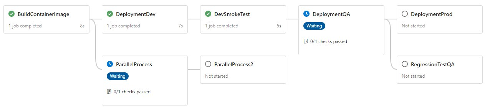

# Parallel stages and azure self-hosted agents

## Cloud Research

- Due to some tasks that I need to complete for my job, today I worked complete my cloud day working with Azure DevOps. I learned how to use self-hosted agents and also use in the correct way parallel stages.

  

- I'm planning to start my #awscertified path tomorrow, starting to study for the AWS Architect Pro

## Social Proof

[Twitter](https://twitter.com/cmgomezm15/status/1293016446428209155)
