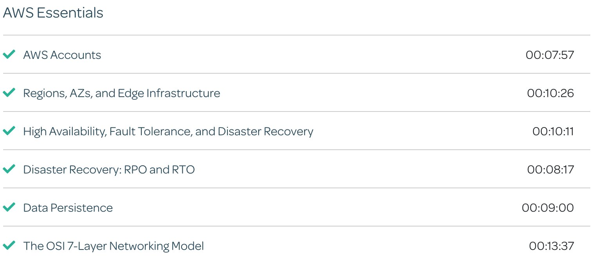

# AWS Essentials

## Cloud Research

- I took the AWS Essentials section from the Linux Academy course for the AWS Solutions Architect Pro. It's pretty important has excellent understanding about things like HA, DR, FT, regions, AZ, networking protocols...

  

## Social Proof

[Twitter](https://twitter.com/cmgomezm15/status/1296258120390508546)
